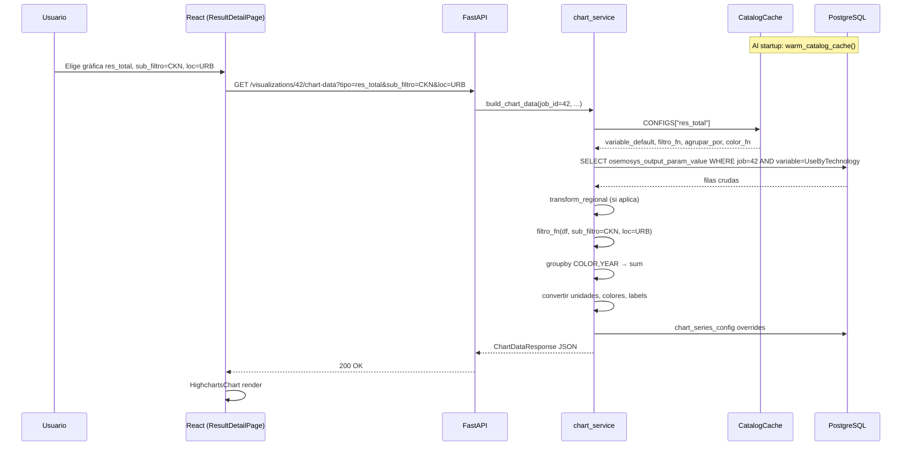

# Flujo de datos de visualización: simulación → frontend

Este documento describe **cómo se extraen los resultados de una simulación OSeMOSYS**, cómo se **filtran y agregan** en el backend, y cómo llegan al **frontend** para renderizar gráficas interactivas. Está escrito para desarrolladores que mantienen el módulo `app/visualization` o la UI de resultados.

---

## 1. Panorama general

El sistema tiene **cuatro capas** que trabajan en cadena:

```text
┌─────────────────────────────────────────────────────────────────────────────┐
│ 1. SIMULACIÓN (Pyomo + HiGHS)                                               │
│    pipeline.py → results_processing.py → INSERT osemosys_output_param_value │
└───────────────────────────────────┬─────────────────────────────────────────┘
                                    │
┌───────────────────────────────────▼─────────────────────────────────────────┐
│ 2. CATÁLOGO EN BD (catalog_meta_*) + cache en memoria al startup             │
│    Qué variable leer, qué tecnologías incluir, colores, labels, menú UI     │
└───────────────────────────────────┬─────────────────────────────────────────┘
                                    │
┌───────────────────────────────────▼─────────────────────────────────────────┐
│ 3. chart_service.build_chart_data()                                         │
│    SQL → DataFrame → filtros → agrupación → unidades → colores → JSON       │
└───────────────────────────────────┬─────────────────────────────────────────┘
                                    │
┌───────────────────────────────────▼─────────────────────────────────────────┐
│ 4. FRONTEND (React + Highcharts)                                            │
│    ChartSelector → GET /chart-data → HighchartsChart / LineChart / …        │
└─────────────────────────────────────────────────────────────────────────────┘
```

**Principio clave:** el frontend **no filtra datos crudos**. Solo envía parámetros (`tipo`, `sub_filtro`, `loc`, `region`, …) al API; **todo el filtrado y la agregación ocurren en el backend** sobre filas de PostgreSQL.

---

## 2. Fase 1 — De la simulación a PostgreSQL

### 2.1 Entrada

1. El usuario lanza una simulación (`POST /api/v1/simulations`).
2. Celery ejecuta `app/simulation/pipeline.py`: procesamiento de datos → construcción del modelo Pyomo → solver HiGHS → `results_processing.py`.

### 2.2 Extracción post-solve

`results_processing.py` recorre las variables del modelo resuelto y produce filas con esta forma lógica:

| Campo | Descripción |
|-------|-------------|
| `variable_name` | Nombre OSeMOSYS (`ProductionByTechnology`, `UseByTechnology`, `Dispatch`, …) |
| `value` | Valor numérico del solver |
| Columnas tipadas | Para variables “principales”: `technology_name`, `fuel_name`, `year`, `id_timeslice`, … |
| `index_json` | Para variables intermedias: lista de índices `[REGION, TECHNOLOGY, FUEL?, YEAR, …]` |

### 2.3 Persistencia

Las filas se insertan en **`osemosys.osemosys_output_param_value`**, ligadas a **`simulation_job.id`**.

Ejemplos de variables que alimentan gráficas habituales:

| Gráfica típica | `variable_default` en catálogo |
|----------------|-------------------------------|
| Consumo por sector | `UseByTechnology` |
| Producción eléctrica | `ProductionByTechnology` |
| Capacidad instalada | `TotalCapacityAnnual` o `NewCapacity` |
| Emisiones | `AnnualTechnologyEmission` / `AnnualEmissions` |
| Despacho | `Dispatch` |

Hasta este punto **no hay filtrado de negocio**: la BD guarda **todo** lo que produjo el modelo para ese job.

---

## 3. Fase 2 — Catálogo de visualización (metadatos en BD)

### 3.1 Tablas relevantes

| Tabla | Qué define |
|-------|------------|
| `catalog_meta_chart_config` | Cada **`tipo`** de gráfica (`gas_consumo`, `res_total`, …): variable, agrupación default, reglas de filtro, color_fn, flags |
| `catalog_meta_filter_group` + `catalog_meta_filter_member` | Conjuntos reutilizables de códigos de tecnología/combustible |
| `catalog_meta_chart_subfilter` | Sub-filtros del selector (CKN, CARRETERA, NGS, …) |
| `catalog_meta_chart_module` / `_submodule` | Menú jerárquico del frontend |
| `catalog_meta_label` | Etiquetas legibles (`PWRSOLRTP` → "Solar FV") |
| `catalog_meta_color_palette` | Colores por grupo (`fuel`, `pwr`, `sector`, `emission`) |
| `chart_series_config` | Overrides admin: orden, color, alias, ocultar series **después** del cálculo |

### 3.2 Cache al arranque del API

En `main.py`, al iniciar FastAPI:

1. `warm_catalog_cache(db)` lee todas las tablas `catalog_meta_*`.
2. Construye un objeto **`CatalogCache`** en memoria con:
   - `configs` — diccionario compatible con el antiguo `CONFIGS` (incluye función `filtro` ya compilada).
   - `menu` — árbol de módulos/submódulos/gráficas para el selector.
   - `labels`, paletas de colores, `filter_resolver`, etc.
3. `catalog_sync.sync_catalog_safely()` inserta charts nuevos del deploy de forma idempotente (no es la fuente de lectura en runtime).

**Sin cache inicializado, el API no arranca** (big bang: BD obligatoria).

### 3.3 De la BD a una función `filtro`

Para cada fila en `catalog_meta_chart_config`:

1. Se lee `filtro_kind` + `filtro_params_json` (o se infiere un grupo desde `filtro_group_id`).
2. `filter_engine.build_filter_fn(spec, resolver)` devuelve un **callable** con firma:

   ```python
   filtro(df: pd.DataFrame, sub_filtro: str | None = None, loc: str | None = None) -> pd.DataFrame
   ```

3. Ese callable se guarda en `configs[tipo]["filtro"]` dentro del cache.

El **`FilterResolver`** materializa en memoria los grupos de la BD:

- `resolver.tech("TECNOLOGIAS_GAS_CONSUMO")` → `frozenset` de códigos de tecnología.
- `resolver.fuel("FUELS_LIQUIDOS")` → `frozenset` de combustibles.
- `resolver.subfiltro_group("SUBFILTROS_RESIDENCIALES", "CKN")` → tecnologías del sub-sector cocina.

---

## 4. Fase 3 — API REST de visualización

Rutas principales (`app/api/v1/visualizations.py`):

| Endpoint | Uso |
|----------|-----|
| `GET /visualizations/{job_id}/chart-data` | Una gráfica, un escenario |
| `GET /visualizations/chart-data/compare` | Comparación multi-escenario por año |
| `GET /visualizations/chart-data/compare-facet` | Un panel completo por escenario |
| `GET /visualizations/chart-data/compare-line` | Línea de totales por escenario |
| `GET /visualizations/{job_id}/timeslices` | Timeslices disponibles en el job |
| `GET /visualization-catalog/menu` | Menú del selector (sin job) |

### 4.1 Parámetros de filtrado que acepta `chart-data`

| Parámetro | Quién lo envía | Efecto en backend |
|-----------|----------------|-------------------|
| `tipo` | Selector de gráfica | Elige la entrada en `CONFIGS` / catálogo |
| `un` | Selector de unidad | Conversión PJ → GW, TWh, ktCO₂eq, … |
| `sub_filtro` | Dropdown sub-sector | Pasado a `filtro(df, sub_filtro=…)` |
| `loc` | URB / RUR / ZNI | Solo gráficas residenciales con `sector_sub_loc` |
| `variable` | Gráficas de capacidad | Override de `variable_default` |
| `agrupar_por` | Selector agrupación | Override de TECNOLOGIA / FUEL / SECTOR / … |
| `region` | Jobs REGIONAL | Filtra o agrupa por región SIN |
| `timeslice` | Selector TS | Filtra filas a un timeslice concreto |
| `es_porcentaje` | Modo % | Normaliza cada año a 100 % |

El endpoint valida que el job esté en estado **`SUCCEEDED`** y delega en `chart_service.build_chart_data()`.

---

## 5. Fase 4 — Pipeline interno de `build_chart_data`

Archivo: `app/visualization/chart_service.py`, función `build_chart_data`.

### 5.1 Resolución de configuración

```python
cfg = CONFIGS[tipo]   # en runtime: facade → get_configs() → CatalogCache
variable_name = cfg["variable_default"]   # o override si es capacidad
```

Si `tipo` no existe → `ValueError` → HTTP 400.

### 5.2 Carga SQL → DataFrame

`_load_variable_data(db, job_id, variable_name)`:

1. Query a `osemosys_output_param_value` + LEFT JOIN `timeslice` (código TS).
2. **Variables tipadas** (`Dispatch`, `NewCapacity`, …): columnas directas.
3. **Variables intermedias** (`ProductionByTechnology`, …): parseo heurístico de `index_json` → columnas `TECHNOLOGY`, `FUEL`, `YEAR`, `TIMESLICE`, `VALUE`.

Resultado mínimo garantizado:

```text
TECHNOLOGY | FUEL | TIMESLICE | YEAR | VALUE
```

### 5.3 Transformación regional (si aplica)

Si `simulation_job.simulation_type == 'REGIONAL'`:

- `_apply_regional_transform()` llama a `regional.transform_regional_df()`.
- **Antes del filtro**, porque en BD las tecnologías llevan prefijo geográfico (`SE_PWRSOLRTP`) y los grupos de filtro asumen códigos sin prefijo (`PWRSOLRTP`).

Tres modos según parámetros:

| `region` | `agrupar_por` | Comportamiento |
|----------|---------------|----------------|
| (vacío) | ≠ REGION | Acumulado nacional: quita prefijos, colapsa regiones |
| `AN`…`SO` | ≠ REGION | Solo esa región, sin prefijo en TECHNOLOGY |
| (cualquiera) | REGION | Agrupa series por código de región |

### 5.4 Filtro principal (`cfg["filtro"]`)

```python
df = filtro_fn(df, sub_filtro=sub_filtro, loc=loc)
```

Aquí entra el **motor de filtros** (sección 6). Si el DataFrame queda vacío → respuesta con `series: []`.

### 5.5 Filtro por timeslice

```python
if timeslice:
    df = df[df["TIMESLICE"] == timeslice]
```

Si no se pasa `timeslice`, se **suman todos los TS** al agrupar por año (comportamiento histórico).

### 5.6 Post-procesamiento pre-agregación

Orden típico:

1. **Alias eléctricos** (`PWR_TECH_ALIASES`) para charts `cap_electricidad`, `prd_electricidad`, …
2. **Conversión por tecnología** (mapas kton especiales, si el config lo define).
3. **Columna `COLOR`** según `agrupar_por` (ver tabla abajo).
4. **`groupby(["COLOR", "YEAR"]).sum()`** → agregación anual por serie.
5. Descarte de series con suma total ≤ 1e-5.
6. **Conversión de unidades** (`_convertir_unidades`: PJ baseline).
7. **Modo porcentaje** (opcional): cada año suma 100 %.
8. **Asignación de colores** vía `color_fn` del config o paleta BD.
9. **`apply_global_series_config()`** — orden/oculto/alias desde `chart_series_config`.
10. Construcción de **`ChartDataResponse`**: `{ categories, series[{name, data, color}], title, yAxisLabel }`.

### 5.7 Agrupaciones (`agrupar_por`)

| Valor | Columna `COLOR` resultante |
|-------|---------------------------|
| `TECNOLOGIA` | Código de tecnología (o `TECH::FUEL` en refinerías split) |
| `FUEL` | Grupo de combustible (`asignar_grupo`) |
| `GROUP` | Grupo derivado de tech+fuel |
| `SECTOR` | Residencial, Industrial, … (`MAPA_SECTOR`) |
| `EMISION` | Código de emisión |
| `REGION` | AN, CA, IN, … |
| `TRANSPORTE_GRUPO` / `MODO` | Agrupaciones especiales transporte |
| `H2_PRODUCCION` / `ELECTROLISIS` | Mapeos cromáticos H₂ |

### 5.8 Respuesta JSON (ejemplo)

```json
{
  "title": "Sector Residencial — UseByTechnology (PJ)",
  "yAxisLabel": "PJ",
  "categories": ["2025", "2030", "2035"],
  "series": [
    { "name": "Res. Gas Natural", "color": "#d9d9d9", "data": [1.2, 1.5, 1.8], "stack": "default" },
    { "name": "Res. Electricidad", "color": "#ffd519", "data": [0.8, 1.0, 1.1], "stack": "default" }
  ]
}
```

El frontend **no recalcula** estos valores; solo los pinta.

---

## 6. Motor de filtros (`filter_engine.py`) — detalle

### 6.1 Grupos en BD

**`catalog_meta_filter_group`**: nombre lógico (`TECNOLOGIAS_RESIDENCIALES`, `COMBUSTIBLES_H2`, …).

**`catalog_meta_filter_member`**: cada fila es una regla:

| Campo | Ejemplo |
|-------|---------|
| `member_kind` | `CODE` o `GROUP_REF` |
| `operation` | `INCLUDE` / `EXCLUDE` |
| `entity_type` | `TECHNOLOGY` / `FUEL` |
| `match_mode` | `EXACT`, `STARTSWITH`, … |
| `value` | `PWR`, `DEMRESCKN_HIG`, `NGS` |
| `ref_group_id` | Referencia a otro grupo (composición) |

Al cargar el cache, `_load_filter_groups()` resuelve referencias recursivamente y produce conjuntos finales `frozenset`.

### 6.2 Tipos de filtro (`filtro_kind` / `kind` en JSON)

| `kind` | Cuándo se usa | Lógica |
|--------|---------------|--------|
| `group` | Mayoría de charts | `TECHNOLOGY` o `FUEL` ∈ grupo resuelto |
| `sector_sub` | Industrial, transporte, terciario | Si hay `sub_filtro` → subconjunto; si no → grupo raíz |
| `sector_sub_loc` | Residencial | Igual + filtro `loc` (URB/RUR/ZNI) |
| `ref_ambas` | Refinerías Cartagena+Barra | Tecnologías refinería × combustibles con/sin crudo según `sub_filtro` |
| `fuel_exclude_tech` | H₂ | Combustibles del grupo MINUS tecnologías excluidas |
| `tech_and_fuel` | Líquidos demanda | Intersección tech_group ∧ fuel_group |
| `demand_fuel` | Demanda por combustible | Tech en grupo demanda + fuel válido |
| `recursos_carbon` | Recursos vs demanda carbón | Composición tech + fuel + exclusiones |
| `startswith` | Filtros legacy mínimos | `TECHNOLOGY.str.startswith(prefix)` |

### 6.3 Ejemplo concreto: residencial

**Config en BD** (`res_total`):

- `filtro_kind`: `sector_sub_loc`
- `root_group`: `TECNOLOGIAS_RESIDENCIALES`
- `subfiltros_dict`: `SUBFILTROS_RESIDENCIALES`
- `loc_groups`: `{ "URB": "TEC_RES_URB", "RUR": "TEC_RES_RUR", "ZNI": "TEC_RES_ZNI" }`

**Flujo cuando el usuario elige:**

- Gráfica: `res_total`
- Sub-filtro: `CKN` (cocina)
- Loc: `URB`

```text
1. Cargar todas las filas UseByTechnology del job
2. transform_regional_df (si REGIONAL)
3. filtro():
   a. TECHNOLOGY ∈ TECNOLOGIAS_RESIDENCIALES
   b. TECHNOLOGY ∈ SUBFILTROS_RESIDENCIALES["CKN"]  → TECNOLOGIAS_RESIDENCIALES_CKN
   c. TECHNOLOGY ∈ TEC_RES_URB
4. groupby COLOR=TECHNOLOGY, YEAR → sum VALUE
5. JSON al frontend
```

### 6.4 Sub-filtros en el menú UI

En `catalog_meta_chart_subfilter` (sembrado desde `chart_menu.py`):

- `RES_SUB = [CKN, WHT, AIR, REF, ILU, TV, FAN, WSH, OTH]`
- `TRA_SUB = [LDV, FWD, BUS, TCK_C2P, …]`

El frontend muestra un `<select>` solo si el ítem del menú tiene `hasSub: true` y lista `subFiltros`. El valor elegido viaja como query param `sub_filtro`.

---

## 7. Fase 5 — Frontend

### 7.1 Carga del menú (qué gráficas existen)

1. `useChartMenu()` → `GET /visualization-catalog/menu` (público, sin auth en menú).
2. Mapea la respuesta a la estructura `Module[]` / `ChartItem[]`.
3. `ChartSelector` renderiza módulos, subsectores y lista de gráficas.
4. Cada ítem trae metadatos: `hasSub`, `hasLoc`, `allowedGroupings`, `soportaPareto`, …

**No hay menú hardcodeado en runtime** (fallback eliminado): si falla el API, el selector muestra error.

### 7.2 Estado de selección (`ChartSelection`)

Interface en `ChartSelector.tsx`:

```typescript
interface ChartSelection {
  tipo: string;           // id de gráfica, ej. "gas_consumo"
  un: string;             // PJ, GW, TWh, …
  sub_filtro?: string;    // CKN, CARRETERA, …
  loc?: string;           // URB | RUR | ZNI
  variable?: string;      // capacidad: TotalCapacityAnnual, …
  agrupar_por?: string;   // TECNOLOGIA | FUEL | SECTOR | …
  region?: string;        // AN..SO (jobs REGIONAL)
  timeslice?: string | null;
  viewMode: 'column' | 'line' | 'area' | 'pareto' | 'table' | 'porcentaje';
  // … preferencias de tabla, orientación barras, etc.
}
```

Cada cambio en un control llama `onChange({ ...value, sub_filtro: e.target.value })`.

### 7.3 Fetch de datos (`ResultDetailPage`)

`useEffect` observa `chartSelection` y `jobId(s)`:

```typescript
simulationApi.getChartData(jobId, {
  tipo: chartSelection.tipo,
  un: chartSelection.un,
  sub_filtro: chartSelection.sub_filtro,
  loc: chartSelection.loc,
  agrupar_por: chartSelection.agrupar_por,
  region: chartSelection.region,
  timeslice: chartSelection.timeslice ?? undefined,
})
```

Cliente HTTP: `frontend/src/features/simulation/api/simulationApi.ts` → `GET /visualizations/{jobId}/chart-data`.

### 7.4 Renderizado

Según `viewMode`:

| Modo | Componente | Qué hace con `ChartDataResponse` |
|------|------------|----------------------------------|
| `column` | `HighchartsChart` | Barras apiladas: `categories` = eje X, cada `series` = stack |
| `line` / `area` | `LineChart` | Líneas/áreas; soporta series sintéticas (localStorage) |
| `pareto` | `ParetoChart` | Endpoint `/pareto-data` |
| `table` | `ChartDataTable` | Matriz categorías × series en HTML |

Highcharts **no conoce OSeMOSYS**; solo recibe arrays numéricos ya filtrados y agregados.

### 7.5 Modos de comparación

| Modo UI | Endpoint | Idea |
|---------|----------|------|
| `facet` | `/compare-facet` | Una gráfica completa por escenario |
| `by-year` | `/compare?group_by=year` | Un subplot por año; barras = escenarios |
| `by-year-alt` | `/compare?group_by=scenario` | Un subplot por escenario; barras = años |
| `line-total` | `/compare-line` | Una línea por escenario (totales anuales) |

Los mismos parámetros `sub_filtro`, `loc`, `region` se propagan a todos estos endpoints.

---

## 8. Capas adicionales que afectan lo que ve el usuario

### 8.1 Labels (`labels.py` + BD)

`get_label(code)` resuelve nombres de serie:

1. Cache BD (`catalog_meta_label`)
2. Fallback `DISPLAY_NAMES` estático
3. Generación dinámica por segmentos del código
4. Fallback al código crudo

Se aplica **después** del filtrado, al construir `series[].name`.

### 8.2 Colores (`colors.py` + BD)

En runtime, funciones como `_color_electricidad` leen paletas desde **`CatalogCache`** (`color_map_pwr`, `colores_grupos`, …). Si el cache no está disponible (solo en scripts aislados), usan constantes legacy.

### 8.3 Configuración admin de series (`chart_series_config`)

Tabla `osemosys.chart_series_config`: por (`tipo`, `agrupar_por`, `series_code`):

- Reordenar series
- Cambiar color / alias
- Ocultar series

`apply_global_series_config()` se ejecuta **al final** de `build_chart_data`, después de calcular valores y colores automáticos.

### 8.4 Data Explorer (tabla ancha)

Ruta paralela: `GET /simulations/{jobId}/output-values/wide`.

Usa `data_explorer_filters.py` (mapeo chart → prefijos tech/fuel/emission) para pre-filtrar la tabla cuando el usuario hace clic en “Ver datos”. **No comparte el pipeline pandas de gráficas**, pero los prefijos deben ser **consistentes** con el catálogo (`data_explorer_filters_json` en BD).

---

## 9. Diagrama de secuencia (caso típico)



---

## 10. Checklist de depuración

Si una gráfica sale vacía o incorrecta, revisar en este orden:

1. **¿Hay filas en BD?** `osemosys_output_param_value` para ese `job_id` y `variable_name`.
2. **¿El `tipo` existe en catálogo?** Tras `alembic upgrade head` y restart del API.
3. **¿El filtro excluye todo?** Probar sin `sub_filtro` / `loc`; revisar grupo en admin (`/visualization-catalog/filter-groups/{code}/resolved`).
4. **¿Job REGIONAL sin transform?** Verificar prefijos en TECHNOLOGY vs grupos de filtro.
5. **¿Timeslice demasiado restrictivo?** Probar sin `timeslice`.
6. **¿Series ocultas por admin?** Tabla `chart_series_config`.
7. **¿Frontend envía params?** Network tab: query string debe incluir filtros activos.

---

## 11. Archivos de referencia

| Archivo | Rol |
|---------|-----|
| `app/simulation/core/results_processing.py` | Extracción solver → filas BD |
| `app/visualization/catalog_cache.py` | Cache catálogo + compilación filtros |
| `app/visualization/filter_engine.py` | Intérprete de reglas de filtro |
| `app/visualization/chart_service.py` | Pipeline SQL → JSON |
| `app/visualization/regional.py` | Prefijos regionales SIN |
| `app/api/v1/visualizations.py` | Endpoints HTTP |
| `app/services/chart_series_config_service.py` | Overrides de series |
| `frontend/src/pages/ResultDetailPage.tsx` | Orquestación fetch + render |
| `frontend/src/shared/charts/ChartSelector.tsx` | Controles de filtro UI |
| `frontend/src/features/simulation/api/simulationApi.ts` | Cliente API |

---

## 12. Resumen en una frase

**Los resultados crudos viven en PostgreSQL por job; el catálogo en BD define qué variable leer y qué tecnologías/combustibles incluir; `chart_service` carga, filtra, agrupa y colorea en pandas; el frontend solo elige parámetros y dibuja el JSON que devuelve el API.**
