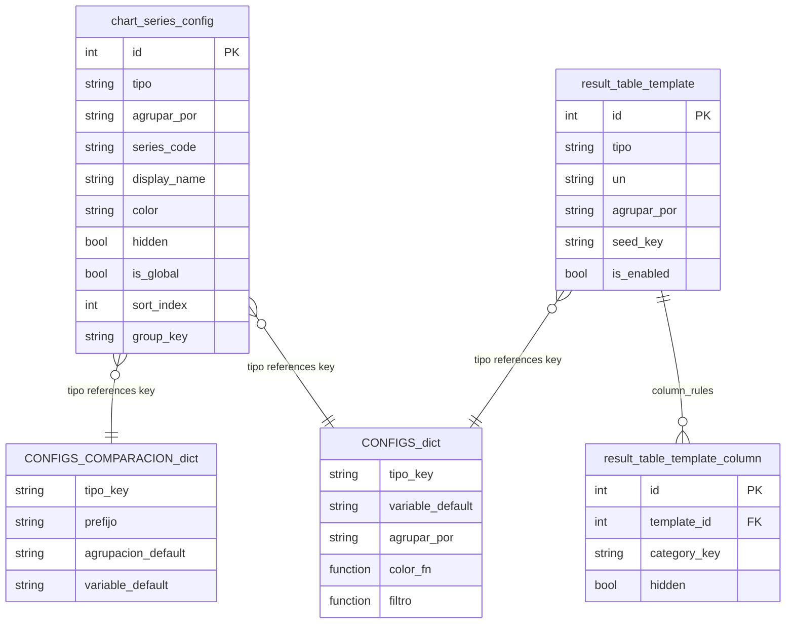
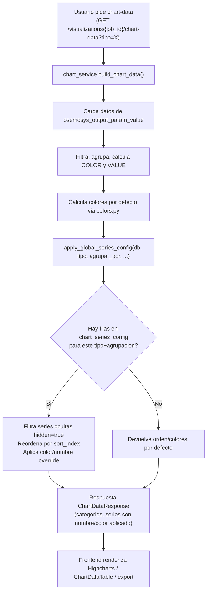

# Instructivo: Configuración Global de Series de Gráficas

Este documento describe las tablas involucradas, cómo se relacionan entre sí, el flujo de datos desde la base de datos hasta la gráfica, cómo agregar nuevos tipos de gráfica al sistema y cómo administrar la configuración global de series desde la interfaz.

**Alcance:** funcionalidad introducida en los commits `d97ad86` (series globales + plantillas de tablas), `55f23bc` (`is_global` + reordenamiento por arrastre) y `65addb2` (retiro de UI de tablas del informe).

---

## 1. Tablas involucradas y su estructura

### 1.1 `osemosys.chart_series_config` (tabla principal)

Tabla que almacena la configuración global de cada serie (nombre, color, orden, visibilidad) por tipo de gráfica y modo de agrupación. Los cambios aquí afectan **todas** las visualizaciones que pasan por `chart_service`: gráficas de barras, líneas, tablas y exportaciones server-side.

| Columna | Tipo | Descripción |
|---------|------|-------------|
| `id` | PK, autoincrement | Identificador único |
| `tipo` | String(64), NOT NULL | Clave del tipo de gráfica (ej. `prd_electricidad`, `cap_electricidad`, `emisiones_total`). Debe coincidir con una key en `CONFIGS` o `CONFIGS_COMPARACION` |
| `agrupar_por` | String(32), NOT NULL | Modo de agrupación: `TECNOLOGIA`, `FUEL`, `GROUP`, `SECTOR`, `EMISION`, `REGION`, `H2_PRODUCCION`, `TRANSPORTE_GRUPO`, `YEAR` |
| `series_code` | String(512), NOT NULL | Código de la serie tal como aparece en la columna `COLOR` del DataFrame en `chart_service.py` (ej. `PWRCOA`, `Gas Natural`, `Transporte`) |
| `display_name` | String(512), NOT NULL | Nombre visible en leyendas, tooltips y tablas |
| `color` | String(32), nullable | Color hex (ej. `#4472c4`). Si es null, se usa el color por defecto de `colors.py` |
| `hidden` | Boolean, default false | Si true, la serie se excluye de la gráfica |
| `is_global` | Boolean, default false | Si true, aplica color/nombre/visibilidad en **cualquier** tipo de gráfica donde aparezca el mismo `series_code` |
| `sort_index` | Integer, default 0 | Orden de apilamiento; menor = primero (abajo en barras apiladas) |
| `group_key` | String(255), nullable | Grupo lógico informativo (ej. familia de tecnología: "Solar", "Hidro") |
| `notes` | Text, nullable | Notas internas del administrador |
| `created_at`, `updated_at` | DateTime | Timestamps automáticos |

**Restricción única:** `(tipo, agrupar_por, series_code)` — no puede haber dos filas con el mismo código de serie para el mismo par tipo+agrupación.

**Índice compuesto:** `(tipo, agrupar_por, sort_index)` — para consultas ordenadas rápidas.

**Modelo ORM:** `backend/app/models/chart_series_config.py`

---

### 1.2 `osemosys.result_table_template` (plantilla de tabla — backend activo, UI deshabilitada)

Define plantillas de tablas automáticas para la página de resultados. El backend, la API y las migraciones siguen activos, pero **la UI fue removida** en el commit `65addb2` (pestaña "Tablas en resultados" en Reportes y sección "Tablas del informe" en ResultDetail). El componente `ResultTablesAdminTab.tsx` existe pero no está montado en ninguna página.

**Columnas clave:**

| Columna | Descripción |
|---------|-------------|
| `name` | Nombre corto en administración |
| `seed_key` | Clave estable para siembra idempotente (Alembic/seed). Null = creado en admin |
| `display_title` | Título sobre la tabla; null → usa título del chart-data |
| `sort_order`, `is_enabled` | Orden y visibilidad para usuarios |
| `tipo`, `un`, `sub_filtro`, `loc`, `variable`, `agrupar_por`, `region`, `timeslice` | Parámetros equivalentes al selector de gráficas |
| `table_period_years`, `table_cumulative` | Opciones de vista tabla |
| `custom_series_order` (JSONB), `y_axis_min`, `y_axis_max` | Presentación adicional |
| `created_by_user_id` | FK a `core.user` |

**Modelo ORM:** `backend/app/models/result_table_template.py`

**Semillas iniciales** (`backend/app/result_table_seeds.py`): cuatro plantillas del sector eléctrico (`default_elec_produccion`, `default_prd_electricidad`, `default_cap_electricidad`, `default_factor_planta`).

---

### 1.3 `osemosys.result_table_template_column`

Reglas de presentación por columna (categoría/año) de una plantilla de tabla. Hijo de `result_table_template` vía FK `template_id` (CASCADE on delete).

| Columna | Descripción |
|---------|-------------|
| `template_id` | FK a `result_table_template.id` |
| `category_key` | Valor de categoría (p. ej. año como string `"2030"`) |
| `hidden` | Ocultar columna |
| `sort_order` | Orden manual de columnas |

**Restricción única:** `(template_id, category_key)`

**Modelo ORM:** `backend/app/models/result_table_template_column.py`

**Nota histórica:** existió `result_table_template_series` (reglas por serie a nivel de plantilla). Fue migrada a `chart_series_config` y eliminada en la migración `20260519_0027`. Las series ahora se gestionan de forma unificada en `chart_series_config`.

---

## 2. Relaciones entre tablas



### Relaciones lógicas clave

| Relación | Descripción |
|----------|-------------|
| `chart_series_config.tipo` → `CONFIGS` / `CONFIGS_COMPARACION` | Referencia lógica (sin FK físico) a las claves de los diccionarios de configuración |
| `chart_series_config` ↔ `result_table_template` | **Independientes**. No hay FK entre ellas. Ambas usan `tipo` como clave lógica común |
| `result_table_template` → `result_table_template_column` | Relación 1:N con cascade delete |
| Series en tablas | Provienen de `chart_series_config` vía `build_chart_data`, no de reglas por plantilla |

### Separación de responsabilidades

| Concern | Dónde vive |
|---------|------------|
| Qué chart mostrar (tipo, un, filtros, agrupación) | `result_table_template` |
| Orden/color/oculto de **series** (filas) | `chart_series_config` (global, aplicado en `build_chart_data`) |
| Orden/oculto de **columnas** (años) | `result_table_template_column` |
| Datos numéricos | `/visualizations/{job_id}/chart-data` |
| Render tabla | `ChartDataTable.tsx` |

---

## 3. Flujo de datos: cómo `chart_series_config` afecta las gráficas



### Detalle de `apply_global_series_config()`

**Ubicación:** `backend/app/services/chart_series_config_service.py` (aprox. línea 565)

**Algoritmo:**

1. Carga filas **locales** para el par `(tipo, agrupar_por)`.
2. Carga filas **globales** (`is_global=true`) indexadas por `series_code` (una entrada por código; gana la primera por `id`).
3. Para cada serie en `orden_color`:
   - **Resolución:** fila local gana sobre fila global del mismo `series_code`.
   - Si `hidden=true` → la serie se excluye.
   - Si tiene `color` → sobreescribe el color por defecto.
   - Si tiene `display_name` → sobreescribe la etiqueta (`get_label()` como fallback).
4. Reordena: series con fila config primero (por `sort_index`, luego índice original); el resto mantiene orden original al final.
5. Retorna `list[tuple[code, color, display_name]]`.

### Puntos de invocación en `chart_service.py`

| Función | Contexto |
|---------|----------|
| `_build_factor_planta_data()` | Gráfica factor de planta (~línea 864) |
| `build_chart_data()` | Ruta principal single-escenario (~línea 1276) |
| `build_comparison_data()` | Comparación multi-escenario por año (~línea 1549) |

**Cobertura indirecta:** `build_comparison_facet_data()` llama `build_chart_data()` por job → hereda la config.

**Rutas que aún NO aplican `apply_global_series_config`:**

- `build_comparison_data_by_year_alt` — orden sorted sin config admin
- `build_comparison_line_data` — totales por escenario, sin desglose por serie

---

## 4. Cómo agregar nuevas gráficas al sistema

El `tipo` debe existir en **tres capas** para que funcione de punta a punta:

```text
CONFIGS (backend)  →  chart-data funciona
ChartSelector MENU (frontend)  →  aparece en el selector
chart_series_config (opcional)  →  colores/nombres/orden admin
```

### Paso 1: Definir la config en `CONFIGS` (backend)

En `backend/app/visualization/configs.py`, agregar una entrada al diccionario `CONFIGS`:

```python
"mi_nueva_grafica": {
    "titulo": "Mi Nueva Gráfica - ProductionByTechnology",
    "figura": "Figura XX",
    "filename": "Fig_XX_MiGrafica",
    "print": "MI NUEVA GRÁFICA",
    "filtro": _filtro_mi_nueva,          # función que filtra el DataFrame
    "msg_sin_datos": "Sin datos para ...",
    "agrupar_por": "TECNOLOGIA",         # o FUEL, SECTOR, EMISION, etc.
    "color_fn": generar_colores_tecnologias,
    "variable_default": "ProductionByTechnology",
}
```

**Opciones adicionales frecuentes:**

| Campo | Uso |
|-------|-----|
| `tiene_sub_filtro`, `label_sub_filtro` | Sub-filtros en el selector |
| `es_capacidad` | Títulos dinámicos por variable de capacidad |
| `es_emision`, `es_emision_kt` | Unidades y conversión de emisiones |
| `es_porcentaje` | Eje Y en % |
| `allowedGroupings` (solo frontend) | Restringir agrupaciones en UI |

Si la gráfica necesita registro en el catálogo de BD (admin curador), agregar también en `backend/app/visualization/chart_menu.py` dentro de `MENU`. El startup ejecuta `catalog_sync.sync_catalog()` con INSERT idempotente (no pisa ediciones del curador).

### Paso 2: Agregar al menú del frontend

En `frontend/src/shared/charts/ChartSelector.tsx`, localizar la estructura `MENU` y agregar un `ChartItem` en el módulo/subsector correcto:

```typescript
{ id: 'mi_nueva_grafica', label: 'Mi nueva gráfica', soportaPareto: false },
```

Opciones útiles:

```typescript
allowedGroupings: ['TECNOLOGIA', 'FUEL'],
defaultGrouping: 'TECNOLOGIA',
soportaPareto: true,
soportaTabla: true,
hasSub: true,
subFiltros: ['NGS', 'COA'],
```

**Nota:** el `MENU` del frontend es **independiente** del `chart_menu.MENU` del backend. Pueden divergir (ej. frontend tiene más variantes eléctricas, módulo `recursos`, upstream con subsectores). Lo crítico es que el `id` del `ChartItem` coincida con la key en `CONFIGS`.

### Paso 3: (Opcional) Definir config de comparación

En `backend/app/visualization/configs_comparacion.py`, si se quiere comparar entre escenarios:

```python
"mi_nueva_grafica": {
    "prefijo": "MITECH",
    "agrupacion_default": "TECNOLOGIA",
    "variable_default": "ProductionByTechnology",
},
```

### Paso 4: Poblar series en `chart_series_config`

**Desde la UI** (Reportes → Series por gráfica):

1. Seleccionar el tipo recién creado en el dropdown.
2. Clic en **"Poblar desde catálogo"** — lee tecnologías/combustibles del catálogo OSeMOSYS y crea filas con colores/nombres iniciales.

**Vía API:**

```http
POST /api/v1/chart-series-config/populate
Content-Type: application/json

{
  "tipo": "mi_nueva_grafica",
  "agrupar_por": "TECNOLOGIA"
}
```

**Poblar todos los tipos:**

```http
POST /api/v1/chart-series-config/populate-all
```

La población es **no destructiva**: solo inserta filas faltantes; no modifica las existentes.

---

## 5. Cómo configurar las series desde la interfaz

### Permisos requeridos

- `is_admin_reports=True` **o** `can_manage_scenarios=True`
- El usuario seed del entorno local tiene `is_admin_reports=True` tras ejecutar `scripts/seed.py`

### 5.1 Desde Reportes (administración general)

1. Ir a la página **Reportes**.
2. Clic en la pestaña **"Series por gráfica"** (solo visible para admins).
3. Seleccionar el **tipo de gráfica** (ej. `prd_electricidad`).
4. Seleccionar la **agrupación** (ej. `TECNOLOGIA`, `FUEL`).
5. Si no hay filas, la UI intenta **población automática** al cargar; también se puede usar **"Poblar desde catálogo"**.

**Acciones disponibles por fila:**

| Acción | Efecto |
|--------|--------|
| Arrastrar (manija `⋮⋮`) | Reordenar → actualiza `sort_index` vía `POST /reorder` |
| Nombre visible | Editar y salir del campo (onBlur → `PATCH`) |
| Color | Picker de color (guarda inmediatamente) |
| Oculta | Excluye la serie de gráficas/tablas/exportaciones |
| Global | Aplica en cualquier tipo de gráfica con el mismo `series_code` |
| Grupo | Texto libre informativo (`group_key`) |
| Quitar | Elimina la fila; la serie vuelve a valores por defecto |

**Botones adicionales:**

- **Poblar todos los tipos** — inserta filas faltantes para todo `CONFIGS` + `CONFIGS_COMPARACION`
- **Recargar** — vuelve a leer la lista desde la API

### 5.2 Desde la página de Resultados (por gráfica específica)

1. Abrir un resultado de simulación (`ResultDetailPage`).
2. Seleccionar una gráfica en el selector.
3. Si eres admin, aparece el botón **"Configurar series"** (icono de engranaje) en la barra de modificadores (vista no-tabla).
4. Se abre un modal con `ChartSeriesConfigTab` fijado al `tipo` y `agrupar_por` de la gráfica actual.
5. Tras guardar cambios, `onApplied` incrementa `chartConfigVersion` y fuerza re-fetch del chart-data.

### 5.3 Agregar una serie manualmente

Si una serie aparece en la simulación pero no se cargó con "Poblar":

1. En **"Agregar serie manualmente"**, escribir en el campo **Código** — autocompletado con sugerencias de `GET /result-table-templates/presentation-options`.
2. Opcionalmente llenar nombre, color y grupo.
3. Clic en **"Añadir serie"**.

El **código** debe coincidir exactamente con el identificador en los datos (columna `COLOR` / nombre de serie en chart-data). Si no aparece en sugerencias, se puede pegar manualmente desde el explorador de datos o CSV.

### 5.4 Reglas de prioridad (local vs global)

```text
1. Fila LOCAL (tipo + agrupar_por + series_code)  →  prioridad máxima
2. Fila GLOBAL (is_global=true, mismo series_code)  →  si no hay local
3. Valores por defecto (colors.py + labels.py)  →  si no hay ninguna fila
```

Ejemplo: si `PWRCOA` tiene color rojo con `is_global=true` en `cap_electricidad`, ese color aplica también en `prd_electricidad` **salvo** que exista una fila local específica para `prd_electricidad` + `TECNOLOGIA` + `PWRCOA`.

---

## 6. API REST disponible

**Prefijo:** `/api/v1/chart-series-config`

**Router:** `backend/app/api/v1/chart_series_config.py`

| Método | Ruta | Descripción |
|--------|------|-------------|
| GET | `/chart-types` | Lista tipos disponibles (`CONFIGS` ∪ `CONFIGS_COMPARACION`) |
| GET | `?tipo=X&agrupar_por=Y` | Filas configuradas para un tipo+agrupación |
| POST | `/populate` | Inserta filas faltantes desde catálogo para un tipo |
| POST | `/populate-all` | Inserta filas faltantes para **todos** los tipos → `{ inserted_rows }` |
| POST | `/row` | Crear fila manual (201) |
| PATCH | `/{id}` | Actualizar `display_name`, `color`, `hidden`, `is_global`, `sort_index`, `group_key` |
| DELETE | `/{id}` | Eliminar fila (204) |
| POST | `/reorder` | Reordenar filas (body: `{ "ids": [3, 1, 2, ...] }`) |

Todos los endpoints requieren autenticación + permiso admin reportes.

### API relacionada (plantillas de tabla — backend activo)

**Prefijo:** `/api/v1/result-table-templates`

| Método | Ruta | Acceso |
|--------|------|--------|
| GET | `` | Plantillas habilitadas (todos autenticados) |
| GET | `/manage` | Admin — todas las plantillas |
| GET | `/presentation-options?tipo=&agrupar_por=&variable=` | Admin — candidatos series/años (usado por autocompletado en `ChartSeriesConfigTab`) |
| POST/PATCH/DELETE | CRUD estándar | Admin |

---

## 7. Migraciones Alembic relacionadas

| Revisión | Archivo | Operación |
|----------|---------|-----------|
| `20260515_0022` | `result_table_template.py` | Crea `result_table_template` |
| `20260516_0023` | `result_table_presentation_relational.py` | Tablas series/column; migra JSONB → relacional |
| `20260517_0024` | `result_table_template_seed_key.py` | `seed_key` + siembra inicial |
| `20260518_0026` | `chart_series_config.py` | **Crea `chart_series_config`** |
| `20260519_0027` | `drop_result_table_series_rules.py` | Migra `result_table_template_series` → `chart_series_config`; elimina tabla legacy |
| `20260519_0028` | `chart_series_config_is_global.py` | **Agrega columna `is_global`** |

**Despliegue:**

```bash
docker compose exec api alembic upgrade head
docker compose exec api python scripts/seed.py   # plantillas seed + permisos usuario seed
```

---

## 8. Archivos clave del sistema

### Backend

| Archivo | Rol |
|---------|-----|
| `backend/app/models/chart_series_config.py` | Modelo SQLAlchemy |
| `backend/app/schemas/chart_series_config.py` | Schemas Pydantic (Public, Create, Update) |
| `backend/app/services/chart_series_config_service.py` | CRUD, población, `apply_global_series_config()` |
| `backend/app/api/v1/chart_series_config.py` | Endpoints REST |
| `backend/app/visualization/chart_service.py` | Invoca `apply_global_series_config()` al construir respuestas |
| `backend/app/visualization/configs.py` | Diccionario `CONFIGS` (~60 gráficas single-escenario) |
| `backend/app/visualization/configs_comparacion.py` | Diccionario `CONFIGS_COMPARACION` |
| `backend/app/visualization/colors.py` | Colores por defecto (familias, sectores, emisiones) |
| `backend/app/visualization/labels.py` | Etiquetas por defecto (`get_label`) |
| `backend/app/visualization/chart_menu.py` | `MENU` para siembra en catálogo BD |
| `backend/app/visualization/catalog_sync.py` | Sync idempotente al startup |
| `backend/app/models/result_table_template.py` | Plantillas de tabla (backend) |
| `backend/app/services/result_table_template_service.py` | CRUD plantillas |
| `backend/app/services/result_table_presentation_options.py` | Candidatos series/años para admin |
| `backend/app/result_table_seeds.py` | Semillas idempotentes |
| `backend/tests/test_chart_series_config.py` | Tests unitarios (local vs global) |

### Frontend

| Archivo | Rol |
|---------|-----|
| `frontend/src/features/reports/components/ChartSeriesConfigTab.tsx` | UI admin de series (drag-and-drop, global, populate) |
| `frontend/src/features/reports/api/chartSeriesConfigApi.ts` | Cliente API |
| `frontend/src/features/reports/api/resultTableTemplatesApi.ts` | Cliente API (presentation-options para autocompletado) |
| `frontend/src/features/reports/components/ResultTablesAdminTab.tsx` | Admin plantillas tablas (**sin montar en UI actual**) |
| `frontend/src/types/domain.ts` | Tipos `ChartSeriesConfigPublic`, `ChartTypeInfo` |
| `frontend/src/pages/ReportsPage.tsx` | Pestaña "Series por gráfica" |
| `frontend/src/pages/ResultDetailPage.tsx` | Botón "Configurar series" + modal |
| `frontend/src/shared/charts/ChartSelector.tsx` | `MENU` del selector (3 niveles) |
| `frontend/src/shared/charts/ChartDataTable.tsx` | Vista tabla (acepta `presentation` para columnas) |

---

## 9. Estado actual de la UI (post `65addb2`)

| Funcionalidad | Estado |
|---------------|--------|
| Series por gráfica (Reportes) | Activo |
| Configurar series (ResultDetail) | Activo |
| Vista tabla manual (`viewMode=table`) | Activo |
| Drag-and-drop + checkbox Global | Activo |
| Tablas en resultados (Reportes) | **Removido de UI** |
| Tablas del informe (ResultDetail) | **Removido de UI** |
| Backend `result_table_templates` | Activo (reactivable) |

---

## 10. Plan de prueba manual

- [ ] **Reportes → Series por gráfica:** poblar, reordenar por arrastre, ocultar/mostrar, marcar Global, crear fila manual.
- [ ] **Resultado → gráfica:** colores/orden/visibilidad coherentes con `chart_series_config`.
- [ ] **Resultado → Configurar series:** modal fijado al tipo actual; cambios se reflejan al guardar.
- [ ] **Resultado → vista Tabla:** datos y exportación funcionan (series vienen del backend con config aplicada).
- [ ] **Comparación multi-escenario (by-year):** series respetan config global.
- [ ] **Alta manual:** autocompletado filtrado; código fuera del catálogo a mano.
- [ ] **Tests backend:** `pytest backend/tests/test_chart_series_config.py`

---

## Referencias

- Guía general del proyecto: `CLAUDE.md` (secciones "Series Configs y Plantillas de Tabla" y "Adding a new single-scenario chart type")
- Módulo de visualización: `backend/app/visualization/README.md`
